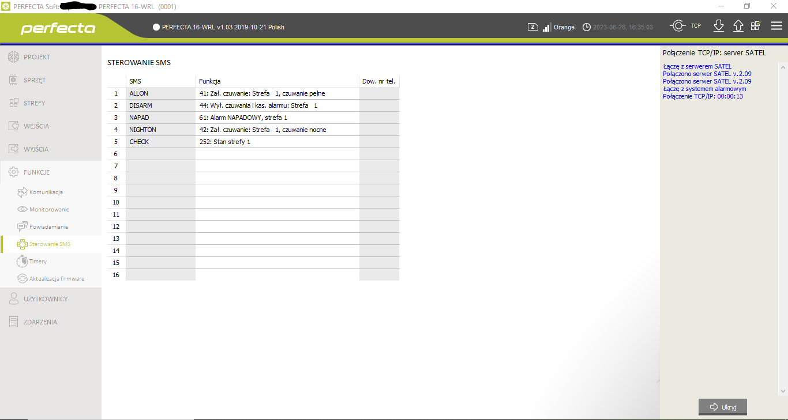
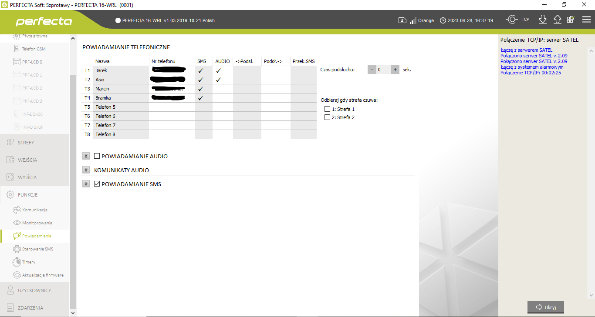

# Installation guide

## Dependencies
* nodejs
* gammu
* mqtt broker (in most scenarios it should be enough to use Home Assistant built in)

## Preliminary setup
This solution needs several things to be prepared before. At this moment I assume you have 
some basic knowledge about linux + shell and you're able to setup some dependencies on your own.

Following list consists of some must-have dependencies needed by this softrware.
 
### PC / Raspberry  / linux enabled device to work as a server
It can be you HASS server or whatever can run linux and has a free USB slot.
 
### GSM modem + SIM card

It's obvious: if you want to control any device with SMS, then you need to have 
an access to SMS gateway. Among the many solutions you could use, I strongly recommend to create 
your own SMS gateway using a retired GSM modem. 
In my case I use Huawei E173 (~3USD). If your modem has a simlock - don't panic, 
if it's Huawei then unlock should be easy. Just use google.

Modem is worthless if you don't have a SIM card. I suggest to buy one with free SMS plan 
to not spent too much money on communication with you SMS enabled device

### Gammu
If you have a modem, then you need to install [Gammu](https://docs.gammu.org/). 
On their homepage you'll find all information about how to setup it.

## Installation
Currently the installation process must be done manually. Here's a list:

1. Install gammu (see previous section)
2. Install nodejs
3. Clone this repository somewhere to your server
4. Copy `config.json.sample` to `config.json` and adjust it to your needs
5. In the directory where you cloned the repo, execute `$ npm i` to install all dependencies
6. Assuming you've successfully installed and configured Gammu, you need to add `node gammu2mqtt.js` to
Gammu configuration to be executed when SMS message received. `gammu2mqtt.js` acts as incoming 
SMS gateway to MQTT channel.
7. If you didn't miss anything, then you should be ready to start the deamons with `$ npm run install`

### Satel Perfecta setup

#### ! Notice
The following instructions describe an example of the default configuration of this broker for the Satel Perfecta 16 alarm central unit, for which this solution was originally prepared. However, this does not change the fact that with minor modifications, the configuration can be used with any other SMS-controlled device.

Configure your alarm panel to accept incoming SMS commands, and send SMS status 
to the GSM number associated with your GSM modem.

Commands setup example


Allowed SMS numbers example


#### Outgoing (HA -> Alarm Panel)
Default configuration has preconfigured 3 commands for Alarm Panel:

| HA MQTT command | SMS command | Description       |
|-----------------|-------------|-------------------|
| ARM_AWAY        | ALLON       | Arm "AWAY"        |
| ARM_NIGHT       | NIGHTON     | Arm "NIGHT" area  |
| DISARM          | DISARM      | DISARM all areas  |

`HA MQTT command` - command send by MQTT alarm panel (Home Assistant)  
`SMS command` - MQTT is mapped to this command and send to Alarm Panel via SMS gateway

Keep in mind that this list can be easily extended by editing `/mappings/command2sms/default.json`

#### Incoming (HA <- Alarm Panel)
I assume that your control panel sends a return SMS confirming its transition to a 
certain state (armed / disarmed / alarm, etc.). Sometimes the content of these SMSes is pre-configured 
by the manufacturer, sometimes the user can edit it by himself. Often the content of these reply 
SMSes can be found in the documentation provided by the manufacturer. Regardless of what device 
you are using, you need to be familiar with the content in order to use this add-on. 
This add-on expects certain keywords in the response from the control panel.

The configuration of your control panel depends on the model and manufacturer of the one you have. 
Always check the manual!

Right now in this repository you'd found a mapping for following manufacturers:

| Manufacturer | Model                     |
|--------------|---------------------------|
| SATEL        | Perfecta 16 WRL (Polish)  |

If there are no mapping for your Alarm Panel - don't worry. Follow the guide below to add new mapping 
in `/mappings/sms2states`. All contributions are highly appreciated!

For more informations around creating your own mappings see Configuration / SMS2States 
mapping basics.

## SMS2States mapping basics
All alarm manufactures has their own standards for SMS responses indicating current state of Alarm Panel. 
This solution originally was created to work with Polish version of SATEL Perfecta. 
In this case, manufacturer has pre-defined SMS message indicating the state. Below I've put some
examples in free translation to English, how to deal between mappings and SMSes

###### SMS Response
```
Armed
Zone 1
Service user
```

###### SMS2States entry (look at  one of `/mappings/sms2states/*.json` files)
```json
[
...
    {
        "smsKeywords": [
          "zone 1",
          "armed"
        ],
        "backResponse": "armed_home"
    }
...
]
```

In the example above you can see how incoming SMS can be mapped to MQTT response recognisable 
by MQTT Alarm Panel component in Home Assistant.

`smsKeywords` - Array of expected keywords in SMS response.
You should pick specific words from the SMS  
`backResponse` - an MQTT command which will be published to STATE_TOPIC (see Configuration) 
 
## Configuration
The service itself only needs an access to MQTT broker. Configuration and mapping files included in this repository covers the common usage, but they might need some adjustments to match your needs, and to work with your alarm panel. 
